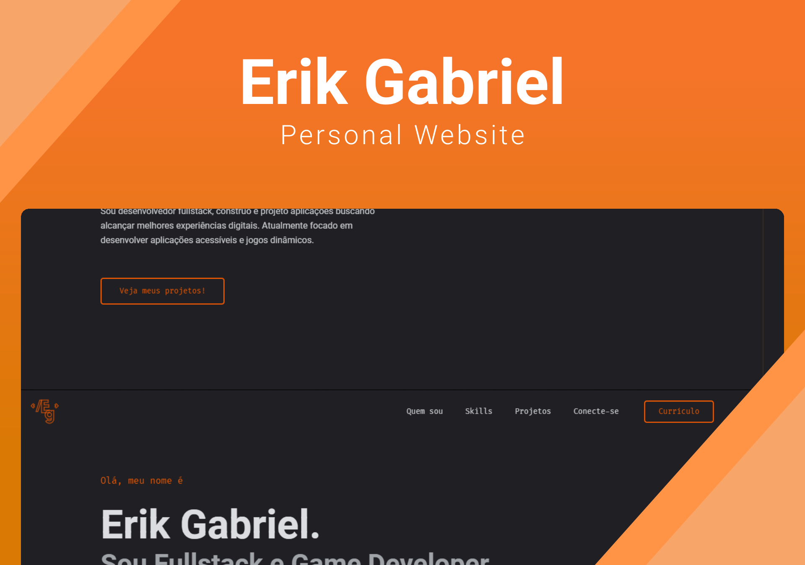

<div align="center">
  
</div>
<h1 align="center">
Personal Website<br>
  erikgabriel.vercel.app 
  
</h1>
<p align="center">
  My personal website <a href="https://erikgabriel.vercel.app" target="_blank">erikgabriel.vercel.app</a> built with <a href="https://nextjs.org/" target="_blank">Next.js</a> and hosted by <a href="https://vercel.com/" target="_blank">Vercel</a>
</p>
<p align="center">
  
  
  

  

  <a href="https://vercel.com/eriikgabriel/portfolio" target="_blank">
    
  </a>
</p>



## 🔗 Forking this repository

For those who want to use my code on their own sites, **yes, it's allowed** as long as they have the proper attributions. In order to avoid direct plagiarism, **please give proper credit by linking back to [erikgabriel.vercel.app](https://erikgabriel.vercel.app) or at least mentioning it**.

Thanks, enjoy the code!

## 🧪 Technologies

This project was developed using the following technologies:

<a href="https://nextjs.org/" target="_blank">
    
</a>
<br>
<a href="https://www.typescriptlang.org/" target="_blank">
    
</a>
<br>
<a href="https://www.mongodb.com/pt-br" target="_blank">
    
</a>
<br>
<a href="https://www.framer.com/motion/" target="_blank">
    
</a>
<br>
<a href="https://stitches.dev/" target="_blank">
    
</a>
<br>
<a href="https://www.radix-ui.com/" target="_blank">
    
</a>

## 🛠️ Installation and Setup

1. Clone the repository

   ```sh
   git clone https://github.com/EriikGabriel/portfolio.git
   ```

2. Access the folder.

   ```sh
   cd portfolio
   ```

3. Install dependecies:

   ```sh
   yarn
   ```

4. Start the development server:

   ```sh
   yarn dev
   ```

   The app will be available for access on your browser at http://localhost:3000

## 🚀 Project Deploy

This project was deployed on the [Vercel](https://vercel.com/) platform and can be accessed [here](https://erikgabriel.vercel.app).

## 📝 License

This project is licensed under the MIT License. See the [LICENSE](LICENSE) file for details.

---

_Developed by [Erik Gabriel](https://github.com/EriikGabriel) 🚀_
