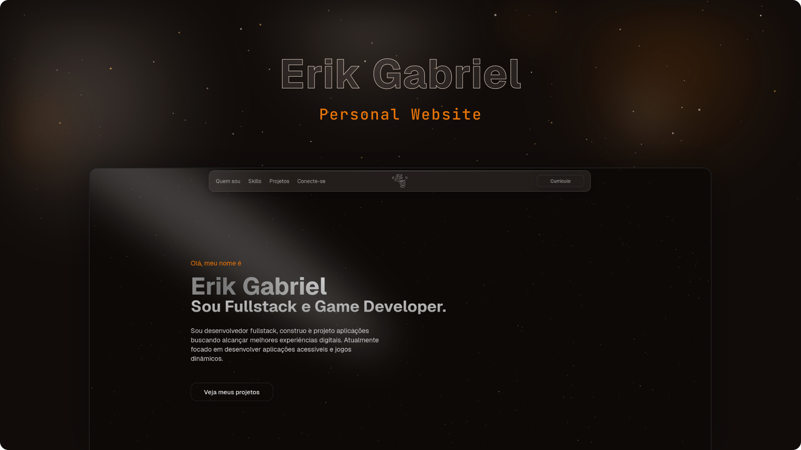

This is a [Next.js](https://nextjs.org/) project bootstrapped with [`create-next-app`](https://github.com/vercel/next.js/tree/canary/packages/create-next-app).

<h1 align="center">
  Personal Website<br>
  erikgabriel.vercel.app
</h1>

<p align="center">
  My personal website and developer portfolio built with
  <a href="https://nextjs.org/" target="_blank">Next.js</a>,
  <a href="https://payloadcms.com/" target="_blank">Payload CMS</a>
  and
  <a href="https://vercel.com/" target="_blank">Vercel</a>.
</p>

<p align="center">
  <a href="LICENSE"></a>
  
  
  <a href="https://vercel.com/eriikgabriel/portfolio" target="_blank"></a>
</p>



## ✨ About

This repository contains my personal website and developer portfolio.

The project is built as a full-stack application using **Next.js App Router** and **Payload CMS**, combining the public portfolio, content management system, API and database layer into a single codebase.

The website focuses on an interactive and animated experience while keeping the application architecture modular and maintainable.

🌐 **Live website:**
https://erikgabriel.vercel.app

---

## 🏗️ Architecture

The application is organized into two main areas inside the Next.js App Router:

```text
                    ┌─────────────────────┐
                    │      Next.js        │
                    │     App Router      │
                    └──────────┬──────────┘
                               │
             ┌─────────────────┴─────────────────┐
             │                                   │
             ▼                                   ▼
     ┌────────────────┐                 ┌────────────────┐
     │    Frontend    │                 │  Payload CMS   │
     │                │                 │                │
     │ Hero           │                 │ Admin          │
     │ About          │                 │ API            │
     │ Projects       │◄───────────────►│ Collections    │
     │ Social         │                 │ Globals        │
     │ Techs          │                 │ Access Control │
     └────────────────┘                 └───────┬────────┘
                                                │
                              ┌─────────────────┼─────────────────┐
                              ▼                 ▼                 ▼
                         PostgreSQL           Media          Migrations
```

### Frontend

The `(frontend)` route group contains the public portfolio.

It is responsible for:

* Page composition
* Navigation
* Hero section
* About section
* Projects
* Technologies
* Social media
* Animations and transitions
* Interactive UI components
* Loading and page transitions

```text
app/(frontend)/
├── components/
│   ├── sections/
│   │   ├── about/
│   │   ├── hero/
│   │   ├── projects/
│   │   ├── social/
│   │   └── techs/
│   │
│   ├── ui/
│   ├── header.tsx
│   ├── footer.tsx
│   ├── logo.tsx
│   └── splash-screen.tsx
│
├── contexts/
├── utils/
├── styles/
├── globals.css
├── layout.tsx
└── page.tsx
```

### Payload CMS

The `(payload)` route group contains the backend and content management layer.

Payload is integrated directly into the Next.js application and provides the admin interface, API, access control, collections, globals and database migrations.

```text
app/(payload)/
├── access/
├── admin/
├── api/
├── collections/
├── globals/
├── migrations/
├── layout.tsx
├── payload.config.ts
└── payload-types.ts
```

This architecture allows the project to manage portfolio content dynamically without requiring a separate backend application.

---

## 🗂️ Content Model

The portfolio content is managed through Payload collections and globals.

### Collections

```text
collections/
├── media.ts
├── projects.ts
├── tags.ts
├── tech.ts
└── users.ts
```

#### Projects

Stores the portfolio projects displayed on the website.

Projects can be associated with technologies and tags and are consumed by the frontend to build the projects section.

#### Tags

Provides categorization for projects and makes it possible to filter the project list.

#### Tech

Stores technologies displayed throughout the portfolio.

#### Media

Handles uploaded assets used by the CMS and website.

#### Users

Handles Payload users and authentication for the CMS.

### Globals

```text
globals/
└── about.ts
```

Globals are used for content that is not tied to a specific collection item.

The `about` global contains the site's main personal/about content.

---

## 🎨 Frontend

The frontend is divided into reusable sections and UI primitives.

### Sections

```text
components/sections/
├── about/
├── hero/
├── projects/
├── social/
└── techs/
```

The **Projects** section is the most modular part of the application and includes:

```text
projects/
├── index.tsx
├── project-card.tsx
├── project-dropdown.tsx
├── project-filters.tsx
├── project-form.tsx
├── project-grid.tsx
└── project-tags.tsx
```

This separation allows project rendering, filtering, forms, tags and layout to evolve independently.

---

## 🧩 UI System

The project includes a collection of reusable visual components under:

```text
app/(frontend)/components/ui/
```

These components are used to build the interactive visual language of the website.

The UI layer is intentionally separated from the page sections so that visual components can be reused across the application.

---

## 🔄 State & Transitions

The frontend uses React contexts for application-level interaction states:

```text
components/contexts/
├── loading.tsx
└── projects-transition.tsx
```

These contexts handle global loading behavior and transitions related to the projects experience.

The project also includes dedicated components such as:

* `main-content-gate.tsx`
* `splash-screen.tsx`
* `motion.tsx`

to coordinate the initial loading and animated page experience.

---

## 🔍 SEO

SEO and crawler configuration are handled natively through Next.js.

```text
app/
├── robots.ts
└── sitemap.ts
```

### Robots

`robots.ts` generates the application's `robots.txt` configuration.

It controls which routes can be crawled by search engines and references the application's sitemap.

### Sitemap

`sitemap.ts` generates the sitemap dynamically through Next.js.

There is **no manually maintained `sitemap.xml` file** in the repository.

Next.js generates the XML endpoint automatically from the `sitemap.ts` configuration.

---

## 🛠️ Technologies

### Framework & Language

* **Next.js**
* **React**
* **TypeScript**

### Backend & CMS

* **Payload CMS**
* **PostgreSQL**
* **GraphQL**
* **REST API**
* **Lexical**

### Styling & UI

* **Tailwind CSS**
* **Radix UI**
* **Tailwind Variants**
* **Tailwind Merge**
* **Lucide React**

### Animation & Graphics

* **Framer Motion**
* **Motion**
* **GSAP**
* **Three.js**
* **React Three Fiber**
* **React Three Drei**
* **OGL**
* **tsParticles**
* **Simplex Noise**
* **maath**
* **Rough Notation**

### Developer Experience

* **Biome**
* **ESLint**
* **Prettier**
* **PostCSS**
* **Bun**

---

## 📁 Project Structure

```text
portfolio/
├── app/
│   ├── (frontend)/
│   │   ├── components/
│   │   │   ├── sections/
│   │   │   └── ui/
│   │   ├── contexts/
│   │   ├── styles/
│   │   ├── utils/
│   │   ├── globals.css
│   │   ├── layout.tsx
│   │   └── page.tsx
│   │
│   ├── (payload)/
│   │   ├── access/
│   │   ├── admin/
│   │   ├── api/
│   │   ├── collections/
│   │   ├── globals/
│   │   ├── migrations/
│   │   ├── payload.config.ts
│   │   └── payload-types.ts
│   │
│   ├── robots.ts
│   └── sitemap.ts
│
├── public/
│   ├── assets/
│   └── icons/
│
├── biome.json
├── components.json
├── luxe.json
├── next.config.ts
├── package.json
├── postcss.config.cjs
├── tsconfig.json
└── README.md
```

---

## 🛠️ Installation

### 1. Clone the repository

```bash
git clone https://github.com/EriikGabriel/portfolio.git
```

### 2. Access the project

```bash
cd portfolio
```

### 3. Install dependencies

Using Bun:

```bash
bun install
```

Or using npm:

```bash
npm install
```

### 4. Configure environment variables

Create an environment file based on the variables required by the application.

The project requires the appropriate configuration for the Payload CMS and database environment.

> Never commit production credentials or secrets to the repository.

### 5. Start the development server

```bash
bun dev
```

Or:

```bash
npm run dev
```

The application will be available at:

```text
http://localhost:3000
```

---

## ⚙️ Development

The main development workflow is centered around Next.js.

```bash
bun dev
```

The Payload admin panel is available through the application's `/admin` route.

The API is exposed through the Payload API route:

```text
/api
```

---

## 🗃️ Database Migrations

Database migrations are versioned inside:

```text
app/(payload)/migrations/
```

Each migration contains the required changes to keep the database schema synchronized with the Payload configuration.

This allows database changes to be tracked and reproduced across environments.

---

## 🧬 Generated Types

Payload generates TypeScript definitions based on the configured collections and globals.

The generated types are stored in:

```text
app/(payload)/payload-types.ts
```

This provides type safety between the CMS configuration and the application consuming its data.

---

## 🚀 Deployment

The project is deployed on **Vercel**.

🌐 **Production:**
https://erikgabriel.vercel.app

The architecture is designed to run the Next.js application and Payload CMS together while connecting the application to its configured database and storage services.

---

## 🔗 Forking This Repository

You're welcome to use this project as a reference or starting point for your own website.

If you fork or reuse substantial parts of the project, please provide proper attribution by linking back to:

**https://erikgabriel.vercel.app**

or mentioning the original repository:

**https://github.com/EriikGabriel/portfolio**

Please don't present the original design or implementation as your own work.

Thanks, and enjoy the code!

---

## 📝 License

This project is licensed under the **MIT License**.

See the [LICENSE](LICENSE) file for details.

---

<div align="center">

Developed by **Erik Gabriel** 🚀

</div>
